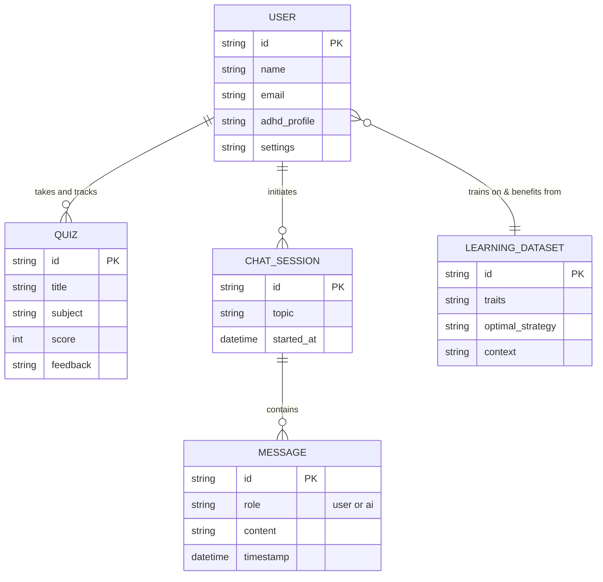
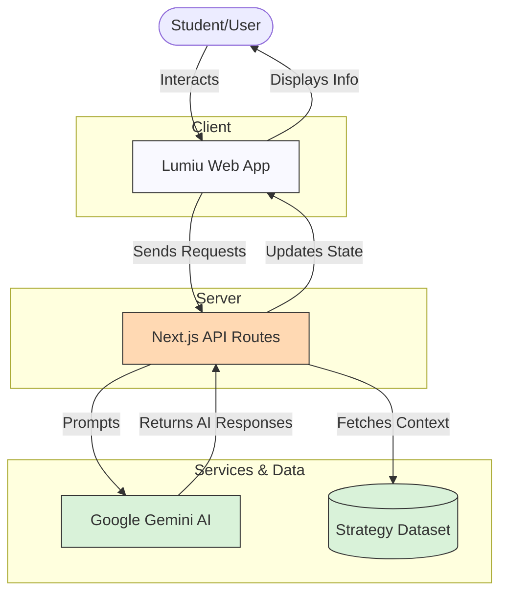

# Lumiu PWA: Entity-Relationship and Dataflow Diagrams

This document contains the structural and behavioral diagrams for the entire Lumiu PWA project, focused on its AI-powered adaptability features, chat, and learning ecosystem. You can convert this file into a PDF using standard Markdown-to-PDF tools or extensions.

## 1. Entity-Relationship (ER) Diagram

This diagram maps out the core logical entities within the system. Since the PWA is primarily client-centric and relies on real-time LLM interactions, this represents the internal object model and data structures passed around.

## 2. Dataflow Diagram (DFD)

This diagram outlines how data moves from the user through the Next.js API Routes out to Google Gemini AI, and back as actionable insights or dynamic application states.

---
*Note: This architecture highlights the real-time AI capabilities (powered by Gemini) and the localized datasets handling the adaptability engine inside the PWA.*
